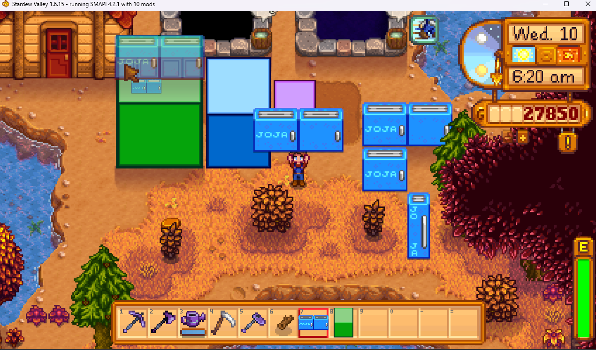
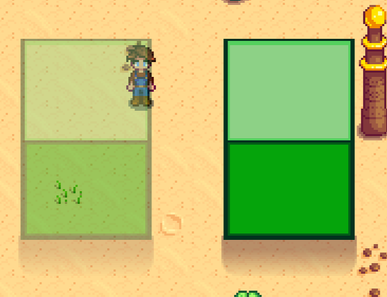

## **Bigger Machines**
Is a [Stardew Valley](http://stardewvalley.net/) mod to allow content packs to easily add big craftables larger than one tile!



## Install
1. Install the latest version of [SMAPI](https://smapi.io).
2. Install [this mod from Nexus Mods](http://www.nexusmods.com/stardewvalley/mods/33660).
3. Run the game using SMAPI.

## Use
### For players
This mod does nothing on its own; you need to install content packs by unzipping them into your
`Mods` folder.   
See _Requirements_ > _Mods requiring this file_ on the Nexus mod page to find
content packs.

## For mod authors
Set the following fields in the [Bigger craftables's `CustomFields`](https://stardewvalleywiki.com/Modding:Big_craftables#Advanced).


**REQUIRED:**

`"Jok.BiggerMachines.Dimensions": "H,W"` -- where H is height and W is width. `"2,3"` would be a 2x3 item

  

Optionals:

`"Jok.BiggerMachines.EnableTransparency": "true"` -- makes it so the big craftable fades out when the player is behind them, like buildings or trees

`"Jok.BiggerMachines.DrawShadow": "true"` -- draws a shadow at the base of the big craftable like buildings have

`"Jok.BiggerMachines.IsChest": "true"` -- makes the object work as a chest (animations not supported)

Example of transparency and shadow:  


The Bigger Machines also work as machines, they can have effects, animations, inputs, outpus, etc.
Sprites are assumed to have a widths in multiples of 16, but height is a lot more flexible.
For animations they must be to the right of the base sprite. Spritesheets also cannot be multiple rows. 


Small example:
```json
{
	"Format": "2.6.0",
	"Changes": [
		{
			"Action": "EditData",
			"Target": "Data/BigCraftables",
			"Entries": {
				"Jok.BiggerCraftables.Purple": {
					"Name": "Big Purple Guy",
					"DisplayName": "{{i18n:Jok.BiggerCraftables.Purple.name}}",
					"Description": "{{i18n:Jok.BiggerCraftables.Purple.description}}",
					"Price": 300,
					"Fragility": 0,
					"CanBePlacedOutdoors": true,
					"CanBePlacedIndoors": true,
					"IsLamp": true,
					"Texture": "Mods\\Jok.BiggerMachines.Example\\iridium-box",
					"SpriteIndex": 0,
					"ContextTags": null,
					"CustomFields": {
						"Jok.BiggerMachines.Dimensions": "2,2"
					}
				},
            }
        }
}
```

See [Example Content Pack.zip](<[CP] Bigger Machines Example.zip>).

## Compatibility
Compatible with Stardew Valley 1.6+ on Linux/macOS/Windows, both single-player and multiplayer.

## Credits
Artwork for the cubes and some draw code:
[By Spacechase0's BiggerCraftables](https://github.com/spacechase0/StardewValleyMods/blob/develop/BiggerCraftables)
